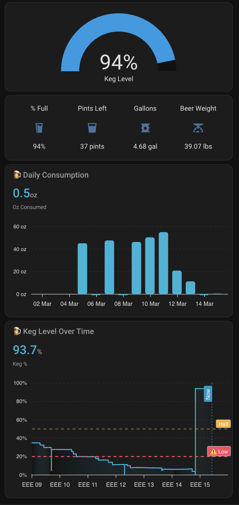

# keg-scale

> I homebrew sparkling water. These kegs are 5-gallon Cornelius kegs left over from my brewing days, now repurposed with a CO2 tank to carbonate water at home. No beer involved.

NodeMCU v2 (ESP8266) with an HX711 load cell amplifier. Weighs a carbonated water keg and exposes derived sensors to Home Assistant for tracking remaining volume.

## Hardware

| Component | Detail |
|---|---|
| Board | NodeMCU v2 (ESP8266) |
| Load cell amp | HX711 — DOUT → D2, CLK → D3 |

## Sensors

| Entity | Unit | Description |
|---|---|---|
| `sensor.keg_scale_keg_weight` | lbs | Raw HX711 reading, calibrated |
| `sensor.keg_scale_keg_water_weight` | lbs | Raw weight minus 9.5 lb keg tare |
| `sensor.keg_scale_keg_gallons_remaining` | gal | Beer weight ÷ 8.34 |
| `sensor.keg_scale_keg_pints_remaining` | pints | Gallons × 8 |
| `sensor.keg_scale_keg_percent_full` | % | Based on 41.7 lb full keg (5 gal cornelius) |

## Calibration

HX711 linear calibration points in `keg-scale.yaml`:

```
260160 → 0 lbs
283944 → 2.205 lbs  (1 kg reference weight)
```

To recalibrate: place a known weight on the scale, read the raw value from the ESPHome logs, and update accordingly.

## ESPHome device stub

Create this file in your ESPHome instance. ESPHome will pull the sensor config directly from GitHub.

```yaml
packages:
  keg_scale: github://bgulla/esphome-configs/keg-scale/keg-scale.yaml@main

esphome:
  name: keg-scale
  friendly_name: keg_scale

esp8266:
  board: nodemcuv2

logger:

api:
  encryption:
    key: # ENTER KEY

ota:
  - platform: esphome
    password: # ENTER PASSWORD

wifi:
  ssid: !secret wifi_ssid
  password: !secret wifi_password
  ap:
    ssid: "Keg-Scale Fallback Hotspot"
    password: # ENTER PASSWORD

captive_portal:
```

Add to your ESPHome `secrets.yaml`:

```yaml
wifi_ssid: "..."
wifi_password: "..."
```

## Home Assistant Dashboard Card



```yaml
type: vertical-stack
cards:
  - type: gauge
    entity: sensor.keg_scale_keg_percent_full
    name: Keg Level
    min: 0
    max: 100
    style: |
      ha-gauge {
        --gauge-color: #b39ddb;
      }
  - type: glance
    show_name: true
    show_icon: true
    show_state: true
    entities:
      - entity: sensor.keg_scale_keg_percent_full
        name: "% Full"
        icon: mdi:beer
      - entity: sensor.keg_scale_keg_pints_remaining
        name: Pints Left
        icon: mdi:cup
      - entity: sensor.keg_scale_keg_gallons_remaining
        name: Gallons
        icon: mdi:barrel
      - entity: sensor.keg_scale_keg_water_weight
        name: Water Weight
        icon: mdi:scale
  - type: custom:apexcharts-card
    header:
      show: true
      title: 🍺 Daily Consumption
      show_states: true
      colorize_states: true
    graph_span: 14d
    span:
      end: day
    apex_config:
      chart:
        height: 200
        background: transparent
        toolbar:
          show: false
      grid:
        borderColor: "#ffffff15"
        strokeDashArray: 4
      tooltip:
        theme: dark
      plotOptions:
        bar:
          borderRadius: 4
      dataLabels:
        enabled: true
        formatter: |
          EVAL:function(val) { return val > 0 ? val.toFixed(1) + ' pt' : ''; }
        style:
          fontSize: 11px
      yaxis:
        min: 0
        labels:
          formatter: |
            EVAL:function(val) { return val.toFixed(0) + ' oz'; }
    series:
      - entity: sensor.keg_scale_keg_pints_remaining
        name: Oz Consumed
        color: "#00b4d8"
        type: column
        unit: oz
        transform: return -x * 16;
        group_by:
          func: diff
          duration: 1d
        show:
          legend_value: true
          in_header: true
  - type: custom:apexcharts-card
    experimental:
      color_threshold: true
    header:
      show: true
      title: 🍺 Keg Level Over Time
      show_states: true
      colorize_states: true
    graph_span: 7d
    span:
      end: day
    now:
      show: true
      label: Now
    apex_config:
      chart:
        height: 250
        background: transparent
        toolbar:
          show: false
      grid:
        borderColor: "#ffffff15"
        strokeDashArray: 4
      tooltip:
        theme: dark
        x:
          format: MMM dd, HH:mm
      fill:
        type: gradient
        gradient:
          shadeIntensity: 1
          opacityFrom: 0.55
          opacityTo: 0.05
          stops:
            - 0
            - 100
      yaxis:
        min: 0
        max: 100
        tickAmount: 5
        labels:
          formatter: |
            EVAL:function(val) { return val.toFixed(0) + '%' }
      xaxis:
        labels:
          datetimeFormatter:
            day: EEE dd
            hour: HH:mm
      annotations:
        yaxis:
          - "y": 20
            borderColor: "#ff4560"
            borderWidth: 2
            strokeDashArray: 6
            label:
              text: ⚠️ Low
              style:
                color: "#fff"
                background: "#ff4560"
          - "y": 50
            borderColor: "#feb019"
            borderWidth: 1
            strokeDashArray: 6
            label:
              text: Half
              style:
                color: "#fff"
                background: "#feb019"
    series:
      - entity: sensor.keg_scale_keg_percent_full
        name: Keg %
        color: "#00b4d8"
        stroke_width: 2
        type: area
        curve: smooth
        extend_to: now
        show:
          legend_value: true
          in_header: true
```
